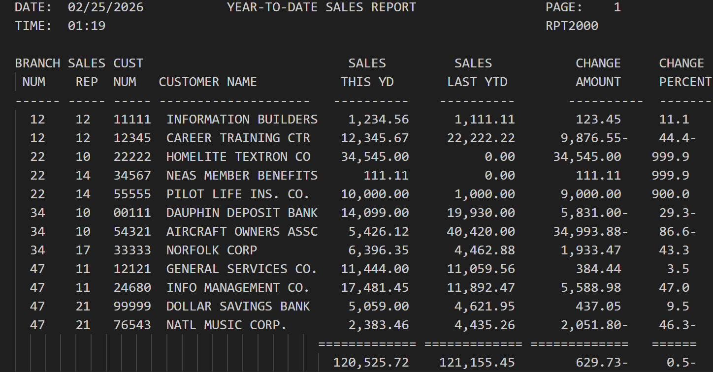

# RPT2000 (COBOL) - SALES REPORT

## Authors
[@bstearns07](https://github.com/bstearns07) Ben Stearns 
[@KirbyD-YEAH](https://github.com/KirbyD-YEAH) Kirby Dunker

---

## Table of Contents
- 📌 [Summary](#-summary)
- ⭐ [How It Works](#-how-it-works)
- ✨ [Features](#-features)
- 🧰 [Tech Stack](#-tech-stack)
- 🔧 [Development Tools](#-development-tools)
- 🧩 [Core Concepts](#-core-concepts)
- 📝 [New Topics Covered](#-new-topics-covered)
- 📘 [What I Learned](#-what-i-learned)
- 🖼 [Screenshots](#-screenshots)

---

## 📌 Summary
### Welcome to the REPORT2000 Sales Report Program!
This COBOL program demonstrates the fundamentals and reading and writing to files by generating a sales report
for a variety of customer vendors. The code provided conforms to mainframe COBOL standards for the enterprise 
mainframe environment.

For every run, the program will:
  1. Open and read the data from the CUSTMAST file
  2. Parse the data from each line of the data file
  3. Perform needed computations for calculated fields
  4. Generate header, customer line, and final total information
  5. Write all the information to the print area for viewing

For full program details, please see [Program Requirements](./assets/Assignment_Instructions.pdf)

## ⭐ How It Works
In order to run this program, please do the following:
- Download the provided JCL, COBOL source code, and CUSTMAST file that contains the data this program relies on
- Add these files to your IBM mainframe environment
- Update the JCL DSN names to match the filepaths of your environment
- Submit the JCL job to your mainframe for processing

---

## ✨ Features
- 📊 Generates a **formatted Year-to-Date Sales Report**  
- 👥 Processes **customer master dataset records**  
- 📈 Calculates:
  - Sales change amount  
  - Percent change from previous year  
- 📄 Produces **multi-page reports with dynamic headings**  
- 🔢 Tracks and displays **grand totals across all customers**  
- 🕒 Includes **current date/time stamping** in report header  
- 🧾 Clean, aligned output using **custom print line structures**  

---

## 🧰 Tech Stack

- **Enterprise COBOL 6.4** – Core batch processing logic  
- **JCL** – Job execution (compile, link, run)  
- **IBM z/OS** – Mainframe environment  

---

## 🔧 Development Tools
- 💻 **Visual Studio Code** with **Zowe Explorer**  
- 🖥️ **IBM z/OS Mainframe** for execution and dataset management  
- 📂 **Partitioned Datasets (PDS)** for source and file storage  

---

## 🧩 Core Concepts
- 📄 **Sequential File Processing** (READ / WRITE operations)  
- 🔁 **Looping with EOF control** (`PERFORM UNTIL`)  
- 🧮 **Business Calculations** (YTD change & percent change)  
- 🧾 **Report Formatting with fixed-length records (130 chars)**  
- 🧱 **Structured COBOL Design** (modular procedure divisions)  
- 📊 **Pagination Logic** (page counts, line limits, headings)  
- ⚠️ **Error Handling** (`ON SIZE ERROR`, divide-by-zero handling)  

---

## 📝 New Topics Covered
1. Reading and writing to/from files with COBOL
2. Proper report alignment and formatting
3. Working with print areas and line/block sizing
4. Data Division and File Description section management

---

## 📘 What I Learned
This project first introduced me to world of report generation. To that end, there was a lot that I learned. Reading information from a file was one of the big topics. This is an essential skill to know as a software developer, and learning how to build a proper working storage to read in the information in an easy-to-use COBOL format was pivitol. Probably the second biggest thing I learned was proper report formatting and alignment. This was an extensive part of the program despite being just about output. Using tools like notepad++ to help make sure I was lining everything up correctly was super helpful.

## 🖼 Screenshots

### Output

[Back to Top](#top)
